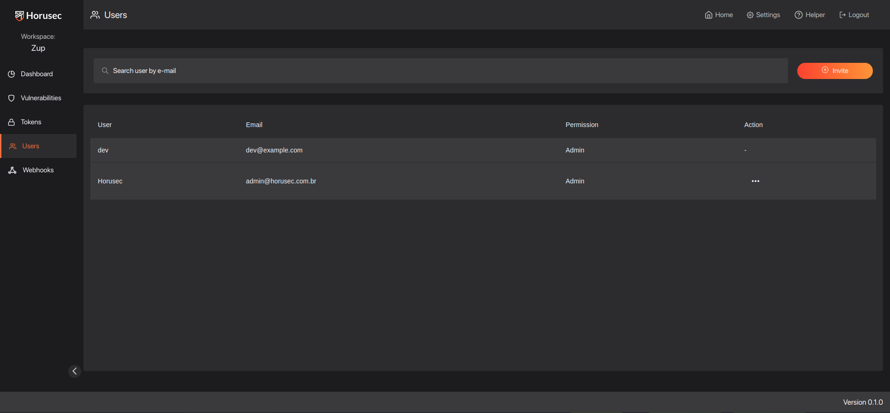

<p align="center" margin="20 0"><a href="https://horusec.io/">
    </a></p>

<p align="center">
    <a href="https://github.com/ZupIT/horusec-platform/pulse" alt="activity">
        </a>
    <a href="https://github.com/ZupIT/horusec-platform/graphs/contributors" alt="contributors">
        </a>
    <a href="https://github.com/ZupIT/horusec-platform/actions/workflows/analytic-pipeline.yml" alt="analytic">
        </a>
    <a href="https://github.com/ZupIT/horusec-platform/actions/workflows/api-pipeline.yml" alt="api">
        </a>
    <a href="https://github.com/ZupIT/horusec-platform/actions/workflows/core-pipeline.yml" alt="core">
        </a>
    <a href="https://github.com/ZupIT/horusec-platform/actions/workflows/manager-pipeline.yml" alt="manager">
        </a>
    <a href="https://github.com/ZupIT/horusec-platform/actions/workflows/messages-pipeline.yml" alt="messages">
        </a>
    <a href="https://github.com/ZupIT/horusec-platform/actions/workflows/migrations-pipeline.yml" alt="migrations">
        </a>
    <a href="https://github.com/ZupIT/horusec-platform/actions/workflows/vulnerability-pipeline.yml" alt="vulnerability">
        </a>
    <a href="https://github.com/ZupIT/horusec-platform/actions/workflows/webhook-pipeline.yml" alt="webhook">
        </a>
    <a href="https://github.com/ZupIT/horusec-platform/actions/workflows/auth-pipeline.yml" alt="auth">
        </a>
    <a href="https://opensource.org/licenses/Apache-2.0" alt="license">
        </a>
</p>

# Horusec Platform

Horusec Platform is a set of web services that integrate with the [Horusec CLI](https://github.com/ZupIT/horusec) 
to facilitate the visualization and management of vulnerabilities.

@todo usage gif

## Dependencies

- [RabbitMQ](https://www.rabbitmq.com/)
- [PostgreSQL](https://www.postgresql.org/)

## Installation

There are several ways to install horusec platform in your environment, choose the one that is most comfortable for you.

Just remember to change the default environment variables values to the new and secure ones.

In some types of installation we use a `make` command to simplify the process.
If you want to know everything that will be executed, take a look at the `Makefile` located at the root of the project.

### Quick Run:

If you just want to try the web interface, we made an image that will automatically configure a ready to use environment.
This image is not recommended for production environments, and will not persist any data after being interrupted.

```cmd
make run-web
```

After executing the command, the Horusec [image](https://hub.docker.com/r/horuszup/horusec-all-in-one) 
will start to install all dependencies and services. After finished, the container logs will present the following message
`HORUSEC WEB IS UP AND CAN BE ACCESSED IN -> http://localhost:8043/auth`.

After that, the application will be running, with all default values, the latest versions, and
the following user for tests:

```
Username: dev@example.com
Password: Devpass0*
```

To stop the running container just execute:

```cmd
make stop-web
```

Click [here](@todo) to check full quick run docs.

### Install with docker compose:

```cmd
make install
```

After executing the command, we will start the docker compose file `compose.yml`, which contains all services, migrations and the needed dependencies. 
The compose file can be found in `deployments/compose/compose.yaml` and migrations in `migrations/source`.

After that, the installation will be ready, with all default values, the latest versions, and
the following user for tests:

```
Username: dev@example.com
Password: Devpass0*
```

By default, the docker compose file is configured to perform a standard installation. 
In the case of production environments, be sure to change the values of the environment variables to new and secure ones.

Click [here](https://horusec.io/docs/web/installation/install-with-docker-compose) 
to check full docker compose installation docs.

### Install with helm:

@todo

The helm files for each service can be found at `deployments/helm`.

Click [here](https://horusec.io/docs/web/installation/install-with-helm) to check the helm installation docs.

### Install with horusec admin:

@todo

### Install with horusec operator:

@todo

### Install with terraform:

@todo

## Features

The following are some main features that Horusec Platform provides, to learn more about these and several other 
features access our [documentation](https://horusec.io/docs/web/overview).

### MultiTenancy

Distribute only the necessary [permissions](https://horusec.io/docs/web/overview/#1-multitenant) according to each user.

<p align="center" margin="20 0"></p>

### Dashboard

Dashboard with various metrics about your vulnerabilities for both workspace and repository.

<p align="center" margin="20 0"></p>

### Vulnerability Management

Vulnerability management screen, allowing to identify false positives, accepted risk and even modify a severity 
to a value appropriate to the reality of the vulnerability.

<p align="center" margin="20 0"></p>

### Tokens
Creation of workspace or repository authentication 
[tokens](https://horusec.io/docs/tutorials/how-to-create-an-authorization-token) for your pipeline.

<p align="center" margin="20 0"></p>

### Authentication Types

With the Horusec Platform you can choose which form of authentication you will use.

Currently, having three possibilities:

- HORUSEC (native) 
- LDAP
- KEYCLOAK

Checkout for our authentication types [docs](https://horusec.io/docs/tutorials/how-to-change-authentication-types).

## Migrating From V1
For more information on migrating from the previous version to the current one see our 
[documentation](@todo).

## Contributing

Feel free to use, recommend improvements, or contribute to new implementations.

If this is our first repository that you visit, or would like to know more about Horusec,
check out some of our other projects.

- [Horusec CLI](https://github.com/ZupIT/horusec)
- [Horusec DevKit](https://github.com/ZupIT/horusec-devkit)
- [Horusec Engine](https://github.com/ZupIT/horusec-engine)
- [Horusec Operator](https://github.com/ZupIT/horusec-operator)
- [Horusec Admin](https://github.com/ZupIT/horusec-admin)
- [Horusec VsCode](https://github.com/ZupIT/horusec-vscode-plugin)

This project exists thanks to all the contributors. You rock! ❤️🚀
