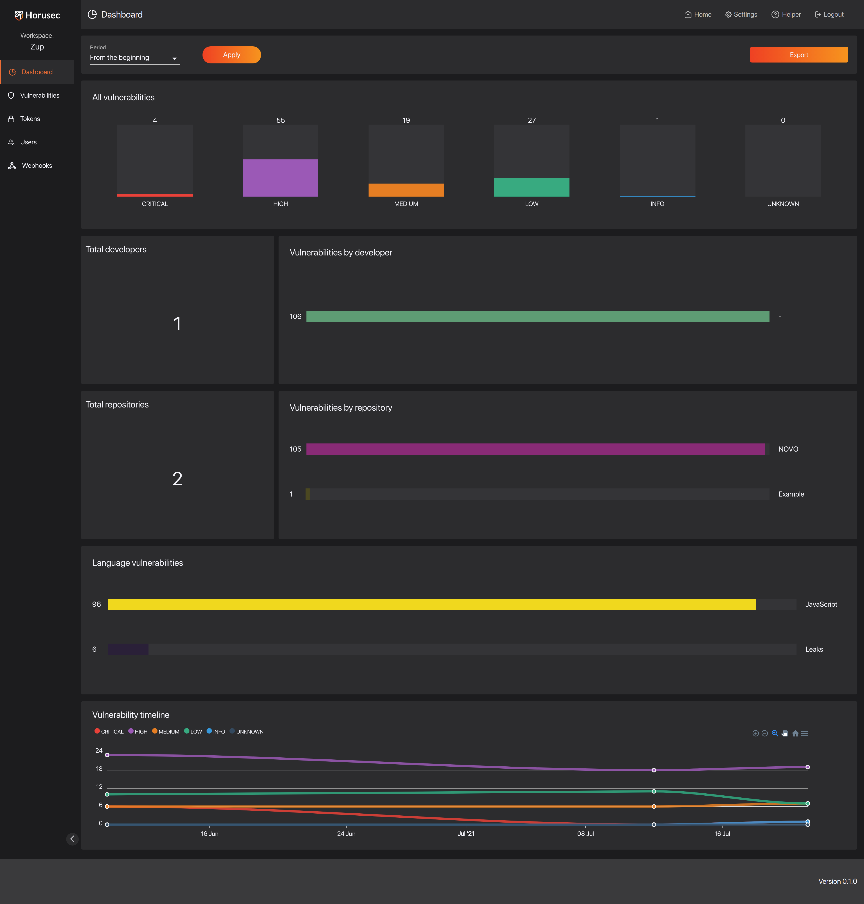

<p align="center" margin="20 0"><a href="https://horusec.io/">
    </a></p>

<p align="center">
    <a href="https://github.com/ZupIT/horusec-platform/pulse" alt="activity">
        </a>
    <a href="https://github.com/ZupIT/horusec-platform/graphs/contributors" alt="contributors">
        </a>
    <a href="https://github.com/ZupIT/horusec-platform/actions/workflows/analytic-pipeline.yml" alt="analytic">
        </a>
    <a href="https://github.com/ZupIT/horusec-platform/actions/workflows/api-pipeline.yml" alt="api">
        </a>
    <a href="https://github.com/ZupIT/horusec-platform/actions/workflows/core-pipeline.yml" alt="core">
        </a>
    <a href="https://github.com/ZupIT/horusec-platform/actions/workflows/manager-pipeline.yml" alt="manager">
        </a>
    <a href="https://github.com/ZupIT/horusec-platform/actions/workflows/messages-pipeline.yml" alt="messages">
        </a>
    <a href="https://github.com/ZupIT/horusec-platform/actions/workflows/migrations-pipeline.yml" alt="migrations">
        </a>
    <a href="https://github.com/ZupIT/horusec-platform/actions/workflows/vulnerability-pipeline.yml" alt="vulnerability">
        </a>
    <a href="https://github.com/ZupIT/horusec-platform/actions/workflows/webhook-pipeline.yml" alt="webhook">
        </a>
    <a href="https://github.com/ZupIT/horusec-platform/actions/workflows/auth-pipeline.yml" alt="auth">
        </a>
    <a href="https://opensource.org/licenses/Apache-2.0" alt="license">
        </a>
</p>

# **Horusec Platform**

Horusec Platform is a set of web services that integrate with [**Horusec CLI**](https://github.com/ZupIT/horusec) to make it easier for you to see and manage the vulnerabilities. 

[comment]: <> (@todo add a gif of manager usage)


## **How to install?**

### **Requirements**
You need to have:

- [**RabbitMQ**](https://www.rabbitmq.com/)
- [**PostgreSQL**](https://www.postgresql.org/)


There are several ways to install the Horusec Platform in your environment.
In some types of installations, we use a `make` command to simplify the process.
If you want to know everything that will be executed, take a look at the `Makefile` located at the project's root.

You can choose what type of installation you want below, but remember to change the default environment variables values to new and secure ones.

### **Install with docker compose**
Follow the steps: 

**Step 1:** Run the command: 
```cmd
make install
```

**Step 2:** Start the docker compose file **`compose.yml`**. It contains all services, migrations and the needed dependencies. 
- You can find the compose file in **`deployments/compose/compose.yaml`**; 
- You can find migrations in **`migrations/source`**.

**Step 3:** After this, the installation is ready with all default values, the latest versions, and the following user for tests:

```
Username: dev@example.com
Password: Devpass0*
```

Docker compose file is configured to perform a standard installation by default.  
In the production environments' case, make sure to **change the values of the environment variables to new and secure ones**.

> :warning: We **do not recommend** using docker-compose installation in a productive environment.

For more information about Docker compose, check out [**Docker compose installation section in our documetation**](https://horusec.io/docs/web/installation/install-with-docker-compose).

### **Install with Helm**

Each release contains its own helm files for that specific version, you can find them [**in the repository**](https://github.com/ZupIT/horusec-platform/releases) and in the folder **`deployments/helm`**.
In both cases they will be separated by each service of the architecture.

For more information, check out [**the installing with Helm section in our documentation**](https://horusec.io/docs/web/installation/install-with-helm).

### **Install with Horusec-Operator**

Horusec-Operator performs management between Horusec web services and its Kubernetes cluster. It was created based on a community’s idea to have a simpler way to install the services in an environment using Kubernetes. 

-  Check out how to install Horusec-Operator in our [**installing section**](https://horusec.io/docs/web/installation/install-with-operator/).
- You can see more about Kubernetes Operators [**in their documentation**](https://kubernetes.io/docs/concepts/extend-kubernetes/operator/).


## **Features**

Horusec Platform provides several features, see some of them below. 

### **MultiTenancy**

It distributes only the necessary [**permissions**](https://horusec.io/docs/web/overview/#1-multitenant) according to each user: 

<p align="center" margin="20 0"></p>

### **Dashboard**

The dashboard shows you various metrics about your vulnerabilities for workspaces and repositories:

<p align="center" margin="20 0"></p>

### **Vulnerability Management**

The vulnerability management screen allows you to identify false positives, accepted risk, and even modify a severity to an appropriate value to the reality of the vulnerability:

<p align="center" margin="20 0"></p>

### **Tokens**
It creates workspaces or repositories authentication 
[**tokens**](https://horusec.io/docs/tutorials/how-to-create-an-authorization-token) for your pipeline: 

<p align="center" margin="20 0"></p>

### **Authentication Types**

You can choose which form of authentication you will use with Horusec Platform.

There are three possibilities:

- HORUSEC (native) 
- LDAP
- KEYCLOAK

For more information about authentication types, check out our [**documentation**](https://horusec.io/docs/tutorials/how-to-change-authentication-types).

[comment]: <> ([comment]: <> &#40;## Migrating From V1&#41;)

[comment]: <> (For more information on migrating from the previous version to the current one see our )

[comment]: <> ([documentation]&#40;@todo&#41;.)

## **Documentation**

For more information about Horusec, please check out the [**documentation**](https://horusec.io/docs/).


## **Contributing**

If you want to contribute to this repository, access our [**Contributing Guide**](https://github.com/ZupIT/charlescd/blob/main/CONTRIBUTING.md). 
And if you want to know more about Horusec, check out some of our other projects:


- [**Horusec CLI**](https://github.com/ZupIT/horusec)
- [**Horusec Devkit**](https://github.com/ZupIT/horusec-platform)
- [**Horusec Engine**](https://github.com/ZupIT/horusec-engine)
- [**Horusec Operator**](https://github.com/ZupIT/horusec-operator)
- [**Horusec Admin**](https://github.com/ZupIT/horusec-admin)
- [**Horusec VsCode**](https://github.com/ZupIT/horusec-vscode-plugin)

## **Community**
Feel free to reach out to us at:

- [**GitHub Issues**](https://github.com/ZupIT/horusec-devkit/issues)
- [**Zup Open Source Forum**](https://forum.zup.com.br)


This project exists thanks to all the contributors. You rock! ❤️🚀
